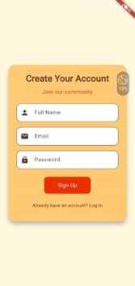

# 🐾 PetCare App

PetCare is a mobile application designed to simplify pet care by offering **veterinary services, product shopping, and account management** in one place.  
Built with **Firebase Authentication, Firestore, and Google Maps API**.

---

## 📖 Features

### 1. 🔐 Login Page
- Email & Password input fields  
- Login button & "Sign Up" link  
- Firebase Authentication for verification  

---

### 2. 📝 Sign Up Page
- Full Name, Email, Password inputs  
- Firebase Authentication + Firestore Users collection  

---

### 3. 🏠 Home Page
- Brown & orange theme  
- Location permission for first-time users  
- Quick access: **Home, Shop, Vet, Profile**  

---

### 4. 🐶 Veterinary Services Page
- Nearby veterinarians with profile, clinic, address, phone  
- Google Maps API + Geolocator integration  

#### 🗺️ Navigation Feature
- Path line between user & vet  
- Start/Stop navigation buttons  

---

### 5. 🛍️ Product Categories Page
- Grooming, Essentials, Fashion, Food, Toys  
- Pet-type category filter  

---

### 6. 📦 Product Description Page
- Product details: image, name, price, description  
- Add to cart + real-time cart count  

---

### 7. 🛒 Shopping Cart Page
- Items with quantity & subtotal  
- Adjust quantity  
- Total price + Checkout  

---

### 8. 💳 Checkout Page
- Delivery address & options  
- Payment method selection  
- Place order button  

---

### 9. 👤 User Profile Page
- User info (name, email)  
- Logout button  

---

## 🛠️ Tech Stack
- **Frontend**: Flutter / React Native  
- **Backend**: Firebase Authentication & Firestore  
- **APIs**: Google Maps API, Geolocator  
- **Storage**: Firebase Storage  

---
